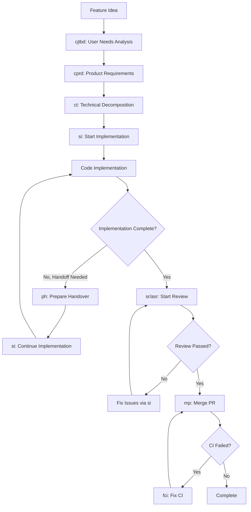

# Claude Commands Directory

This directory contains specialized AI agent commands for the Wythm project. Each command is a highly specialized agent designed for specific workflow stages in the development lifecycle.

## Quick Reference

| Command | File | Purpose | When to Use |
|---------|------|---------|-------------|
| **/cjtbd** | `product/cjtbd.md` | **C**reate **J**TBD | Analyze user needs and jobs-to-be-done (pre-planning) |
| **/cprd** | `product/cprd.md` | **C**reate **PRD** | Define product requirements (pre-planning) |
| **ct** | `ct.md` | **C**reate **T**ask | Create technical decomposition for implementation |
| **si** | `si.md` | **S**tart **I**mplementation | Begin structured TDD implementation of approved tasks |
| **ph** | `ph.md` | **P**repare **H**andover | Prepare comprehensive handover documentation |
| **sr** | `sr.md` | **S**tart **R**eview | Conduct comprehensive code reviews |
| **asr** | `asr.md` | **A**dvanced **S**tart **R**eview | Multi-agent specialized code review with documentation |
| **mp** | `mp.md` | **M**erge **P**R | Handle pull request merging and cleanup |
| **fci** | `fci.md` | **F**ix **CI** | Fix CI pipeline failures after merge |

## Development Workflow



## Command Details

### **/cjtbd** - Create Jobs-to-be-Done
**File**: `product/cjtbd.md`
**Agent Type**: Product Management Specialist
**Purpose**: Analyze user needs and create JTBD document before product requirements

**Use When**:
- Starting a complex feature requiring user research
- Need to understand user jobs and motivations
- Want to validate product ideas before detailed requirements

**Key Outputs**:
- `tasks/task-YYYY-MM-DD-[feature-name]/JTBD-[feature-name].md`
- User job statements in "When/I want/So I can" format
- Pain points and desired outcomes analysis
- Market opportunity assessment

### **/cprd** - Create Product Requirements Document
**File**: `product/cprd.md`
**Agent Type**: Product Management Specialist
**Purpose**: Create comprehensive PRD defining feature scope and requirements

**Use When**:
- Need detailed product specifications before technical planning
- Want to document user stories and acceptance criteria
- Complex features requiring stakeholder alignment

**Key Outputs**:
- `product-docs/PRD/PRD-[feature-name].md`
- Problem statement and user needs
- Feature specifications and scope
- Success metrics and acceptance criteria
- User experience requirements

### **ct** - Create Task
**File**: `ct.md`
**Agent Type**: Task Creation Specialist
**Purpose**: Create technical decomposition with TDD test plan for implementation

**Use When**:
- Starting any new development work
- Need structured implementation roadmap
- Planning complex features or fixes
- Converting requirements into technical tasks

**Sub-Agents Used**:
- **plan-reviewer**: Reviews technical decomposition for implementation readiness
- **architect-reviewer**: Validates architectural decisions
- **task-splitter**: Evaluates if task should be split (provides recommendation document)
- **linear-task-manager**: Creates Linear issues with proper formatting

**Key Outputs**:
- **Single task directory** `tasks/task-YYYY-MM-DD-[kebab-case]/`:
  - `JTBD-[feature-name].md` (optional)
  - `tech-decomposition-[feature-name].md` (required, single source of truth)
- **TDD test plan first**, then implementation steps
- Linear issue creation and tracking setup
- Plan validation and task splitting recommendation

**Workflow Gates**:
1. **GATE 0: Context Gathering** - Check for JTBD/PRD, understand requirements
2. **GATE 1: Technical Decomposition** - Create tech-decomposition-[feature-name].md with TDD test plan, then invoke plan-reviewer + architect-reviewer
3. **GATE 2: Task Splitting Evaluation** - task-splitter creates `splitting-decision.md` if needed (human decides)
4. **GATE 3: Linear Issue Creation** - linear-task-manager creates issue and updates tracking section

### **si** - Start Implementation
**File**: `si.md`
**Agent Type**: Implementation Execution Specialist
**Purpose**: Execute approved task plans with structured Test-Driven Development approach following the **approved test plan**

**Use When**:
- Task plan approved and ready for implementation
- Continuing implementation after addressing code review feedback
- Need structured development workflow with real-time tracking

**Sub-Agents Used**:
- **linear-task-manager**: Updates Linear issue status to "In Progress" and "Ready for Review"
- **task-pm-validator**: Validates tech-decomposition-[feature-name].md completeness before code review
- **create-pr-agent**: Creates GitHub PRs with Linear integration and traceability

**Key Outputs**:
- Code implementation following **TDD Red-Green-Refactor cycle** based on approved test plan
- Real-time progress updates and changelog documentation in `tech-decomposition-[feature-name].md`
- Feature branch with clear commit history
- PR creation with proper formatting and Linear sync

**Quality Requirements**:
- 90%+ test coverage with comprehensive test execution
- All implementation steps in `tech-decomposition-[feature-name].md` completed and documented
- **Linear updates via linear-task-manager** at start and completion phases

### **ph** - Prepare Handover
**File**: `ph.md`
**Agent Type**: Handover Preparation Specialist
**Purpose**: Prepare comprehensive handover documentation for task continuation

**Use When**:
- Implementation needs to be paused before completion
- Context window limits require developer handoff
- Time constraints require task transfer to another developer

**Sub-Agents Used**:
- **linear-task-manager**: Posts handover comment to Linear issue

**Key Outputs**:
- Comprehensive handover documentation in `tech-decomposition-[feature-name].md`
- Current state analysis and progress assessment
- Detailed next steps and continuation instructions
- **Linear issue updates via linear-task-manager** with handover status

### **sr** - Start Review
**File**: `sr.md`
**Agent Type**: Code Review Specialist
**Purpose**: Conduct comprehensive code reviews with actual test execution and quality assessment

**Use When**:
- Implementation completed and needs review
- Code quality validation required before merge
- Ensuring requirements compliance and architectural standards

**Sub-Agents Used**:
- **linear-task-manager**: Updates Linear issue to "In Review", posts review completion, updates final status

**Key Outputs**:
- Detailed `Code Review - [Task Title].md` document with categorized issues
- **Critical Requirement**: Actual test execution results (not just code inspection)
- Issue categorization: Critical (must fix), Major (should fix), Minor (nice to fix)
- **Linear status updates via linear-task-manager** and approval/rejection decisions

**Quality Standards**:
- Root cause analysis and architectural evaluation
- Security and performance impact assessment
- Complete solution verification checklist coverage
- Professional, constructive feedback with specific examples

### **asr** - Advanced Start Review
**File**: `asr.md`
**Agent Type**: Multi-Agent Code Review Specialist
**Purpose**: Conduct comprehensive multi-perspective code review using 5 specialized agents with detailed documentation

**Use When**:
- Need comprehensive review across multiple quality dimensions
- Want specialized expert feedback on code quality, performance, testing, documentation, and security
- Require detailed documentation of findings from each perspective

**Specialized Review Agents**:
- **code-quality-reviewer**: Readability, maintainability, patterns, best practices
- **performance-reviewer**: Algorithm efficiency, database queries, memory usage, bottlenecks
- **test-coverage-reviewer**: Test completeness, edge cases, test quality
- **documentation-accuracy-reviewer**: Documentation completeness, comments, README, API docs
- **security-code-reviewer**: Input validation, auth/authz, sensitive data, vulnerabilities

**Key Outputs**:
- Comprehensive `Advanced Code Review - [Task Title].md` document with:
  - Dedicated sections for each agent's findings
  - Consolidated issues checklist (Critical/Major/Minor) tagged by agent
  - Overall quality assessment showing ratings from all 5 agents
  - Final decision with complete criteria checklist
- PR feedback (inline comments + top-level summary)

**Quality Standards**:
- Each agent provides expert-level feedback in their domain
- Only noteworthy issues reported (high signal-to-noise ratio)
- Comprehensive coverage across 5 quality dimensions

### **mp** - Merge PR
**File**: `mp.md`
**Agent Type**: Merge and Cleanup Specialist
**Purpose**: Handle final merge process with documentation updates and task archival

**Use When**:
- Code review shows "✅ APPROVED FOR MERGE"
- All issues resolved and tests passing
- CI pipeline successful and user explicitly approves merge

**Sub-Agents Used**:
- **docs-updater**: Updates all relevant documentation based on task implementation
- **changelog-generator**: Creates changelog entries for completed tasks
- **linear-task-manager**: Posts completion comment and updates status to "Done"

**Key Outputs**:
- Documentation updates committed to PR before merge
- Changelog generation with implementation and merge details
- PR merge execution with SHA and timestamp documentation
- Task archival to `tasks/completed/` directory (JTBD and tech-decomposition files)
- **Linear issue closure via linear-task-manager** and completion tracking

**Pre-Merge Process**:
1. Documentation updates via docs-updater agent
2. Changelog generation via changelog-generator agent
3. Commit all updates to PR branch before merge
4. Execute merge with appropriate strategy (squash preferred)
5. Update Linear to "Done" via linear-task-manager

### **fci** - Fix CI
**File**: `fci.md`
**Agent Type**: CI Pipeline Specialist
**Purpose**: Fix all CI pipeline failures blocking PR merge while maintaining code quality

**Use When**:
- CI pipeline failed during merge attempt
- Need to resolve linting, typing, testing, or security issues
- Docker build failures or formatting problems

**Key Outputs**:
- Resolution of all CI pipeline failures
- Maintained test coverage (≥80%) and code quality standards
- Security vulnerability fixes and dependency updates
- Docker build validation and smoke testing

**Validation Requirements**:
- Complete CI validation suite execution (matches GitHub Actions)
- Format checking: black, isort compliance
- Type checking: mypy validation with no errors
- Linting: flake8 compliance across codebase
- Security: pip-audit and bandit validation
- Testing: pytest execution with coverage enforcement

## Usage Instructions

### Accessing Commands
Commands are accessed through Claude Code using the specialized agent system:

```bash
# Example usage (through Claude interface):
# Product Planning:
# "Use /cjtbd command to analyze user needs for authentication feature"
# "Use /cprd command to create PRD for authentication feature"

# Technical Implementation:
# "Use ct command to create technical task for user authentication"
# "Execute si command to start implementing the approved task"
# "Use ph command to prepare handover for this implementation"

# Review and Merge:
# "Run sr command to review the completed implementation"
# "Use asr for comprehensive multi-agent review"
# "Execute mp command to merge the approved PR"
# "Use fci command to fix the CI failures"
```

### File Organization
```
.claude/commands/
├── README.md              # This documentation
├── product/
│   ├── cjtbd.md          # Create JTBD analysis
│   └── cprd.md           # Create PRD document
├── ct.md                 # Create technical decomposition
├── si.md                 # Start TDD implementation
├── ph.md                 # Prepare handover
├── sr.md                 # Start code review
├── asr.md                # Advanced multi-agent review
├── mp.md                 # Merge PR and cleanup
└── fci.md                # Fix CI failures
```

### Command Integration

Each command is designed to work seamlessly with the others and specialized sub-agents:

1. **Linear Integration**: All commands use **linear-task-manager agent** for consistent Linear issue updates
2. **Task Documentation**: Commands maintain **single technical decomposition** as source of truth, with optional JTBD/PRD for context
3. **Git Integration**: Commands handle branch creation, commits, and PR management
4. **Sub-Agent Coordination**: Commands orchestrate specialized agents for quality validation
5. **Quality Gates**: Each stage has validation criteria before proceeding to next stage
6. **TDD-First**: Test plans created and approved before implementation begins

### Best Practices

#### Command Sequencing
- **Optional: Start with `/cjtbd`**: Analyze user needs for complex features
- **Optional: Continue with `/cprd`**: Define product requirements
- **Required: Use `ct`**: Create technical decomposition for implementation
- **Implement with `si`**: Use Start Implementation for executing approved tasks
- **Handle handoffs with `ph`**: Use Prepare Handover when implementation needs to pause
- **Continue with `si`**: Resume implementation work using the same Start Implementation command
- **Review with `sr` or `asr`**: Always conduct code review before merging
- **Merge with `mp`**: Use Merge PR for final integration and documentation
- **Fix CI with `fci`**: Address any post-merge CI failures immediately

#### Implementation Flow Options
**Full Product Flow**: `/cjtbd` → `/cprd` → `ct` → `si` → `sr`/`asr` → `mp` → (`fci` if needed)

**Standard Flow**: `ct` → `si` → `sr` → `mp` → (`fci` if needed)

**Handoff Flow**: `ct` → `si` → `ph` → `si` (continuation) → `sr` → `mp` → (`fci` if needed)

**Review Iteration**: `ct` → `si` → `sr` → `si` (address feedback) → `sr` → `mp` → (`fci` if needed)

#### Sub-Agent Integration
- **plan-reviewer**, **architect-reviewer**, **task-splitter**, and **linear-task-manager** automatically invoked during `ct`
- **linear-task-manager**, **task-pm-validator**, and **create-pr-agent** automatically invoked during `si`
- **linear-task-manager** invoked during `ph` for handover comments
- **linear-task-manager** invoked during `sr` for review status updates
- 5 specialized review agents invoked during `asr` for comprehensive multi-perspective review
- **docs-updater**, **changelog-generator**, and **linear-task-manager** automatically invoked during `mp`
- All sub-agents provide validation and quality assurance at key workflow stages

#### Documentation Maintenance
- Commands automatically update task documents with progress and changelog
- Real-time tracking maintained throughout development lifecycle
- Technical decomposition serves as single source of truth
- JTBD/PRD provide optional product context
- Sub-agents ensure documentation consistency and completeness

#### Quality Assurance
- Multiple approval gates in task creation (`ct`) with agent validation
- Test-driven development enforced through `si` implementation process
- Comprehensive code review standards automatically applied in `sr`/`asr`
- CI pipeline validation and fix automation through `fci`

## Sub-Agent Integration Workflow

The workflow commands orchestrate specialized sub-agents to ensure quality and completeness:

### **ct (Create Task)** Sub-Agent Flow
```
User Request → ct Command
    ↓
GATE 0: Context Gathering (Check for JTBD/PRD, understand requirements)
    ↓
GATE 1: Create tech-decomposition-[feature-name].md (TEST PLAN FIRST - TDD)
    ↓
plan-reviewer + architect-reviewer Agents → Validate Test Plan + Technical Approach
    ↓
GATE 2: task-splitter Agent → Creates splitting-decision.md (if needed)
    Human Decides: Follow recommendation or proceed as-is
    ↓
GATE 3: linear-task-manager Agent → Creates Linear Issue
    ↓
Ready for Implementation (Single Technical Decomposition Complete)
```

### **si (Start Implementation)** Sub-Agent Flow
```
Approved Task → si Command
    ↓
linear-task-manager Agent → Update Linear to "In Progress"
    ↓
TDD Implementation (Red-Green-Refactor) Following Approved Test Plan
    ↓
Real-time Documentation Updates in tech-decomposition-[feature-name].md
    ↓
linear-task-manager Agent → Update Linear to "Ready for Review"
    ↓
task-pm-validator Agent → Validates tech-decomposition-[feature-name].md completeness
    (Optionally checks alignment with JTBD/PRD if they exist)
    ↓
create-pr-agent Agent → PR Creation & Linear Sync
    ↓
Ready for Code Review
```

### **mp (Merge PR)** Sub-Agent Flow
```
Approved PR → mp Command
    ↓
docs-updater Agent → Documentation Updates
    ↓
changelog-generator Agent → Changelog Generation
    ↓
Commit Updates to PR Branch
    ↓
Execute Merge
    ↓
linear-task-manager Agent → Update Linear to "Done" with Completion Comment
    ↓
Archive Task (JTBD, tech-decomposition) to tasks/completed/
```

## Integration with Project Workflow

### Claude Code Integration
These commands are designed to work with Claude Code's agent system:
- Each command is a specialized agent with specific expertise
- Sub-agents provide automated quality validation and documentation
- Commands maintain context and state throughout development lifecycle
- Full integration with project tools (Linear, Git, testing frameworks)

### Project-Specific Configuration
Commands are configured for the Wythm project:
- Python-based vocabulary learning application with spaced repetition
- Integration with existing testing and deployment workflows (pytest, mypy, flake8, black, isort)
- Aligned with project architecture and coding standards
- **TDD-first approach** with test plans created before implementation
- **Single technical decomposition** as source of truth, with optional JTBD/PRD context
- 90%+ test coverage requirements

### Quality Assurance Through Sub-Agents
- **plan-reviewer**: Validates test plans and technical approaches before implementation
- **architect-reviewer**: Validates architectural decisions and patterns
- **task-splitter**: Analyzes task complexity and provides splitting recommendations (human decides)
- **linear-task-manager**: Provides consistent Linear integration across all workflow commands
- **task-pm-validator**: Ensures technical documentation completeness before review (checks JTBD/PRD alignment if they exist)
- **create-pr-agent**: Standardizes PR creation with proper Linear integration
- **5 specialized review agents (asr)**: Provide expert feedback across quality, performance, testing, documentation, security
- **docs-updater**: Maintains documentation accuracy post-implementation
- **changelog-generator**: Provides consistent change tracking

---

## Quick Command Reference Card

```
┌──────────────────────────────────────────────────────────────────────┐
│                        CLAUDE COMMANDS                               │
├──────────────────────────────────────────────────────────────────────┤
│ Product Planning (Optional):                                         │
│  /cjtbd │ Create Jobs-to-be-Done analysis for user needs            │
│  /cprd  │ Create Product Requirements Document                      │
├──────────────────────────────────────────────────────────────────────┤
│ Technical Implementation:                                            │
│  ct     │ Create technical decomposition with TDD test plan         │
│  si     │ Execute TDD implementation following approved test plan   │
│  ph     │ Prepare comprehensive handover documentation              │
├──────────────────────────────────────────────────────────────────────┤
│ Review and Merge:                                                    │
│  sr     │ Conduct comprehensive code review with testing            │
│  asr    │ Advanced multi-agent review (5 specialists)               │
│  mp     │ Merge PR with docs/changelog updates                      │
│  fci    │ Fix CI pipeline failures post-merge                       │
└──────────────────────────────────────────────────────────────────────┘

Full Product Flow: /cjtbd → /cprd → ct → si → sr/asr → mp → (fci if needed)
Standard Flow:     ct → si → sr/asr → mp → (fci if needed)
Handoff Flow:      ct → si → ph → si → sr/asr → mp → (fci if needed)
Review Iteration:  ct → si → sr/asr → si → sr/asr → mp → (fci if needed)

Task Structure:    tasks/task-YYYY-MM-DD-[feature-name]/
                   ├── JTBD-[feature-name].md (optional)
                   └── tech-decomposition-[feature-name].md (required)

PRD Location:      product-docs/PRD/PRD-[feature-name].md (separate from tasks)

Quality Gates:     Context Gathering (ct GATE 0), Test Plan + Technical Review (ct GATE 1),
                   Task Splitting Analysis (ct GATE 2), Linear Creation (ct GATE 3),
                   Code Review (sr/asr), Documentation & CI Validation (mp)

Sub-Agents:        plan-reviewer, architect-reviewer, task-splitter, linear-task-manager,
                   task-pm-validator, create-pr-agent, docs-updater, changelog-generator
                   5 review agents (asr): quality, performance, testing, docs, security

Integration:       All commands use linear-task-manager for consistent Linear updates
                   Single tech decomposition maintains all implementation details
                   JTBD/PRD provide optional product context
                   TDD-first ensures test plans drive implementation
```

Use these commands to maintain high-quality, well-documented development processes with automated quality validation, comprehensive multi-agent review, and full traceability from user needs through final implementation.
